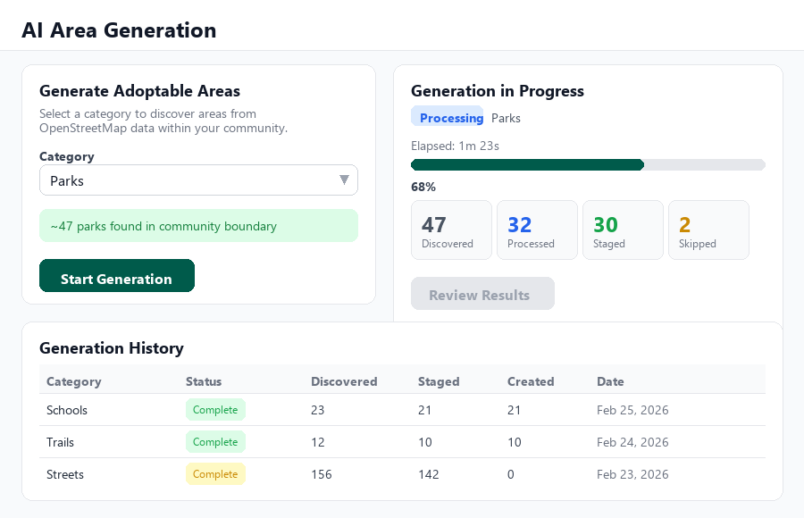
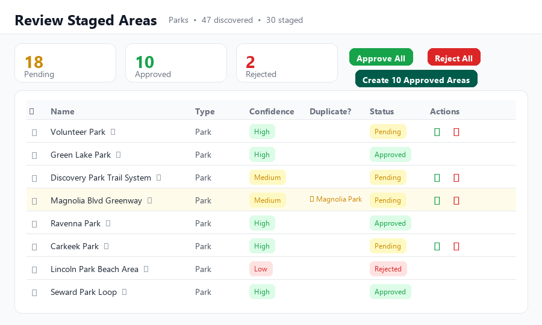
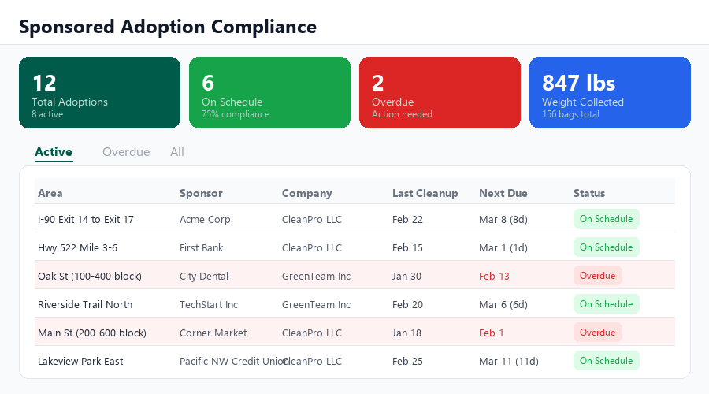

# Adopt-a-Location: How TrashMob Turns a Map Into a Managed Cleanup Program

**Slug:** adopt-a-location-how-trashmob-turns-a-map-into-a-managed-cleanup-program
**Author:** Joe Beernink
**Category:** Features
**Tags:** ["adopt-a-location", "features", "AI", "sponsored-adoptions", "compliance", "maps"]
**Featured:** true
**Estimated Read Time:** 6

---

## Excerpt

A deep dive into TrashMob's adopt-a-location system — AI-powered area generation from OpenStreetMap, interactive map editing, sponsored adoptions for businesses, and the compliance dashboards that keep everyone accountable.

---

## Body

Last time we covered the community tools that give program managers a branded page and volunteer engagement platform. This time we're going deeper into the feature that program managers have been asking about most: adopt-a-location.

If you run an Adopt-a-Highway, Adopt-a-Street, Adopt-a-Park, or any similar program, you know the setup pain. Defining hundreds of adoptable segments. Tracking which team has which section. Managing sponsored segments where businesses pay professional companies to do the work. Chasing down delinquent adopters. Generating reports for stakeholders.

TrashMob handles all of it. Here's how.

### Three ways to define your adoptable areas

Every adoption program starts with a map of locations that need adopters. TrashMob gives you three ways to get those areas onto the platform.

#### 1. AI generation from OpenStreetMap

This is the one that saves the most time. Select a category — parks, schools, streets, trails, highway interchanges, neighborhoods — and TrashMob queries OpenStreetMap to discover every matching feature within your community boundary. The system fetches actual geographic boundaries (not just points), processes them into properly sized adoptable segments, and stages them for your review.

For streets, the system automatically splits long roads into manageable sections (roughly quarter-mile segments) and labels them with compass directions — "Oak Street West," "Oak Street Central," "Oak Street East." For highway interchanges, it enriches each location with the parent motorway reference — "I-90 Exit 17." For all categories, an AI naming model generates clean, human-readable names from the raw OpenStreetMap data.

*The AI generation tool lets you select a category (parks, schools, streets, etc.) and monitors progress in real-time as it discovers and processes areas from OpenStreetMap. The generation history shows previous batches and their results.*

The generation runs in the background while you do other work. A real-time progress panel shows you exactly what's happening: features discovered, features processed, areas staged, and any that were skipped (too small, too large, or outside your boundary). Most communities can generate their entire set of adoptable areas in under ten minutes.

#### 2. Bulk import from existing data

Already have your areas defined in a GIS system? Upload a GeoJSON, KML, KMZ, or Shapefile and TrashMob will parse it, preview the features on a map, and let you map your source fields to TrashMob's data model. The import wizard auto-detects common field names — "name," "category," "cleanup_frequency" — so you're not manually mapping every column. Set defaults for any fields your source data doesn't include, review the validation results, and import. Duplicate names are automatically detected and skipped.

#### 3. Interactive map editor with AI assist

For individual areas, the map editor gives you polygon and line drawing tools right on the map. Draw a park boundary, trace a trail, or outline a highway segment. The editor shows you existing areas in your community so you can avoid overlaps, and it calculates measurements (square footage for polygons, miles for lines) as you draw.

Don't want to draw? Type a natural language description — "the 200 block of Main Street from Oak to Elm" — and the AI suggest tool will generate the geometry for you. It returns a suggested name, area type, and confidence score along with the shape overlaid on the map. Accept it as-is, adjust the vertices, or try again with a different description.

### Review before anything goes live

No matter how you create areas, nothing hits your public map without your approval. AI-generated areas go into a staging table where you can review each one before promoting it to a real adoptable area.

*The review screen shows all staged areas from an AI generation batch with confidence scores, duplicate detection warnings, and inline name editing. Approve or reject individually, or use bulk actions to process the whole batch at once.*

The review screen shows each staged area with its name, type, confidence score (High, Medium, Low), and a flag if it's a potential duplicate of an existing area. Names are editable inline — click the pencil icon, fix the name, save. Approve or reject areas individually, select a batch and approve them together, or approve all pending areas at once. When you're satisfied, click "Create Approved Areas" and they appear on your community's adoption map, ready for teams to claim.

### Team adoptions: the volunteer workflow

Once areas are on the map, volunteer teams can browse available locations on your community page and submit adoption applications. The workflow is straightforward:

1. **Team browses available areas** on the community map (color-coded: green for available, blue for adopted, gray for unavailable)
2. **Team submits an application** with notes about why they want to adopt
3. **Community admin reviews and approves** (or rejects with a reason)
4. **Team links cleanup events** to their adopted area for compliance tracking
5. **System tracks compliance** automatically — event count, frequency, last cleanup date

Teams that fall behind on their cleanup schedule show up as delinquent in your admin dashboard. You can follow up, adjust the requirements, or revoke the adoption and make the area available again.

### Sponsored adoptions: the business model

Not all adoption programs are volunteer-driven. Many communities have Adopt-a-Highway or Adopt-a-Street programs where businesses sponsor segments and hire professional cleanup companies to maintain them. TrashMob supports this three-party model natively.

**Sponsors** are the businesses paying for the adoption — Acme Corp, First Bank, the local dental office. They get visibility on the public map (optional), access to a sponsor dashboard where they can see cleanup history and compliance reports, and CSV exports for their records.

**Professional companies** are the cleanup service providers contracted to do the work. They get a mobile-friendly company dashboard where their crews log each cleanup: date, duration, bags collected, weight removed, and notes. No more paper forms or email reports.

**Sponsored adoptions** tie it all together — linking a specific area to a sponsor and a professional company, with a defined cleanup frequency (default: every 14 days) and start/end dates.

This separation matters. Professional cleanup data is tracked completely separately from volunteer metrics. It never appears on volunteer leaderboards or inflates volunteer impact stats. When your city council asks "how many volunteer hours did we see this quarter?" the answer is clean — paid work and volunteer work are never mixed.

### Compliance dashboards that tell you what needs attention

The compliance dashboard is where program managers spend most of their time — and we built it to surface problems immediately.

*The compliance dashboard shows total adoptions, on-schedule vs. overdue counts, weight collected, and a filterable table with every active adoption. Overdue segments are highlighted in red with the date they were due, so you know exactly who to call.*

At the top: four stat cards showing total adoptions, active adoptions on schedule, overdue count, and total weight collected. Below that, a filterable table with every sponsored adoption — area name, sponsor, professional company, last cleanup date, next due date with a countdown, and a status badge (On Schedule or Overdue). Overdue rows are highlighted in red. Filter by Active, Overdue, or All.

For volunteer team adoptions, a parallel compliance view tracks event count, cleanup frequency, and last event date per adoption. Teams that are at risk (approaching their deadline) or delinquent (past it) are flagged separately so you can intervene before the area becomes a problem.

### Area types for every program

TrashMob supports the full range of adoption program area types:

- **Highway / Interstate Sections** — for DOT Adopt-a-Highway programs
- **Streets** — for city Adopt-a-Street programs
- **Parks** — for park district adoption and stewardship programs
- **Schools** — for school ground adoption programs
- **Trails** — for trail stewardship and maintenance programs
- **Waterways** — for river, creek, and shoreline cleanup programs
- **Interchanges** — for highway interchange adoption
- **Neighborhoods / City Blocks** — for neighborhood-level adoption
- **Spots** — for small, specific locations (bus stops, intersections, trailheads)

Each area type works with polygons (for bounded areas like parks) or linestrings (for linear features like highways and trails). The map editor handles both seamlessly.

### Export and signage

Need to update your physical adoption signs? Export your entire area list with sponsor assignments to CSV. Need to share your areas with another GIS system? Export to GeoJSON or KML. The data flows both ways — import from your existing systems, export back out when you need it elsewhere.

### It all connects

The adoption system isn't a standalone feature — it's woven into the rest of TrashMob. Adopted areas appear on your community page map. Cleanup events linked to adopted areas count toward community impact stats. Volunteer teams see their adopted areas on their team dashboard. Litter reports filed near an adopted area are surfaced to the adopting team. Everything is connected because the data model was designed that way from the start.

### Let's get your program mapped

If you're running an adoption program on spreadsheets and paper maps, or if you've been wanting to start one but the overhead seemed too high — we built this for you. The AI generation tool can have your entire community mapped in minutes, and the compliance dashboards will keep the program running without the manual tracking.

**Visit [trashmob.eco/for-communities](https://www.trashmob.eco/for-communities) to get started, or email [info@trashmob.eco](mailto:info@trashmob.eco) to schedule a walkthrough of the adoption system.**

---

*TrashMob.eco is a 501(c)(3) nonprofit dedicated to empowering communities to keep their neighborhoods clean.*

---

## Screenshots

The following mockup images accompany this article and should be uploaded to Strapi as article body images:

1. **screenshot_ai_generation.png** — AI area generation tool showing category selection, progress monitoring, and generation history
2. **screenshot_review_approval.png** — Review and approval screen for staged areas with confidence scores, duplicate detection, and bulk actions
3. **screenshot_compliance.png** — Sponsored adoption compliance dashboard with stats cards and filterable adoption table

---

## Social Posts

### LinkedIn

We just published a deep dive into TrashMob's adopt-a-location system — the feature that turns an interactive map into a fully managed adoption program.

The highlights:

- AI-powered area generation that discovers parks, schools, streets, trails, and highways from OpenStreetMap and stages them for admin review
- Bulk import from GeoJSON, KML, or Shapefiles for communities with existing GIS data
- Sponsored adoption management for businesses that hire professional cleanup companies — with separate compliance tracking that never mixes paid work with volunteer metrics
- Real-time compliance dashboards showing which segments are on schedule, which are overdue, and who to call

If you manage an Adopt-a-Highway, Adopt-a-Street, or Adopt-a-Park program, this replaces the spreadsheets, the paper maps, and the manual tracking.

We're a 501(c)(3) nonprofit. Volunteers always use it free.

trashmob.eco/for-communities | info@trashmob.eco

#AdoptAHighway #AdoptAStreet #CivicTech #CommunityCleanup #GIS #NonProfit #Sustainability

### Reddit (r/DeTrashed)

We published a walkthrough of the adopt-a-location system we built into TrashMob.eco — the free platform for organizing community cleanups.

The short version: if your group or community wants to run an adopt-a-street/park/trail program, TrashMob now handles the whole thing. You can:

- Use AI to automatically discover every park, school, trail, or street in your area from OpenStreetMap data and stage them for review
- Import existing areas from GeoJSON/KML/Shapefiles if you have GIS data
- Draw areas manually on an interactive map, or describe them in plain English and let AI generate the geometry
- Track which teams adopt which areas, whether they're keeping up with cleanups, and flag delinquent adopters
- Manage sponsored adoptions where businesses pay professional companies (tracked separately from volunteer stats — paid work never inflates volunteer leaderboards)

The compliance dashboard shows on-schedule vs. overdue at a glance. No more spreadsheets.

We're a 501(c)(3) nonprofit and it's free for individual volunteers. Community management tools are available through partnership.

Full post with screenshots on our news page: trashmob.eco/news

### Bluesky

New post: deep dive into TrashMob's adopt-a-location system.

AI discovers areas from OpenStreetMap. Bulk import from GIS files. Interactive map editor with AI assist. Sponsored adoptions with compliance tracking. All connected to community impact data.

If you manage an adoption program with spreadsheets, this is the replacement.

trashmob.eco/news

### Newsletter

This week we published a deep dive into our adopt-a-location system — and if you've ever wondered what it takes to turn a map into a fully managed adoption program, this is the post to read. We cover the AI generation tool that discovers adoptable areas from OpenStreetMap (parks, schools, streets, highways — the whole set), the review workflow that keeps you in control of what goes live, sponsored adoption management for businesses that hire professional cleanup companies, and the compliance dashboards that tell you instantly which segments are on schedule and which need a phone call. We included screenshots of the key screens so you can see exactly what the tools look like. If you know someone running an Adopt-a-Highway or Adopt-a-Street program on spreadsheets and paper maps, forward this their way — we can have them mapped and operational in under a week.
