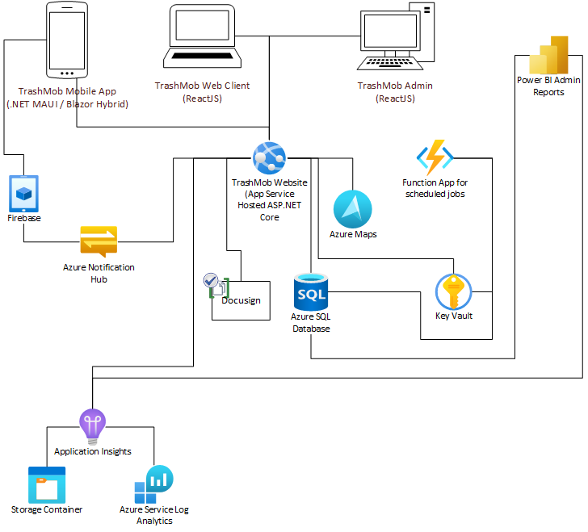

# TrashMob.eco Website

## Overview and Project Layout

This project contains the code for the TrashMob.eco website. 

The client-side of the site is written in ReactJS using the Bootstrap UX Framework. The code for this part of the project is in the client-app folder.

The server side of the site is written in ASP.NET Core 7.0. 

## Components and Integrations

The site integrates with the following backend components as seen the diagram below

| Component Name | Function | Notes |
| --- | --- | --- |
| Azure AD B2C | Authentication Provider | |
| Azure SQL Database | Stores the event-related data | |
| Azure Maps | Handles the display of maps on the site | |
| Application Insights | Metrics Tracking | |
| Azure KeyVault | Secrets Management | |
| Log Analytics | Logging | |
| Docusign | Allows users to sign liability waivers online | |

## General Notes

TBD

